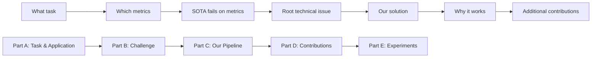

# Introduction Logic Map — Template Catalog

## Logic Map Overview

## Part A: Task Introduction Templates

### A-V1: Task Definition → Application
Use when the task is niche: define it first, then show applications.
- Sentence 1: `[Task] targets at [output] from [input].`
- Sentence 2: `[Task] has applications such as [X], [Y], [Z].`

### A-V2: Application First
Use when the task is already familiar: skip definition, state importance.
- Sentence 1: `[Task] is important because [application context].`

### A-V3: General → Specific Setting
Use when the general area is known but your specific setting is novel.
- Sentence 1: `[General task] has various applications.`
- Sentence 2: `This paper focuses on [specific setting]: [output] from [input].`

### A-V4: Open with Challenge
Use when the task is familiar and you want to expose the challenge early.
- Sentence 1: `[Task importance].`
- Sentence 2: `Previous methods usually [approach].`
- Sentence 3: `Although they work in many cases, they fail at [challenge] because [reason].`

## Part B: Technical Challenge Templates

### B-V1: Challenge Chain (existing task)
- General challenge → traditional methods + limitation → recent methods + limitation → remaining challenge = ours.
- Skeleton: `This is challenging because... Traditional methods... However... Recently... However... because...`

### B-V2: Insight from Traditional Methods
- Mainstream methods + limitation → classical line shares our insight → still insufficient → modern gap.
- Use when your approach echoes an older idea that was abandoned prematurely.

### B-V3: Novel Task Decomposition
- State goal → challenge is hard for N reasons → First... Second... Finally...
- Use when no direct prior methods exist.

## Part C: Pipeline Presentation Templates

### C-V1: One Contribution, Multiple Advantages
- Framework → teaser figure → novelty sentence → implementation → advantages.

### C-V2: Two Contributions
- Framework → contribution 1 + advantage → remaining challenge → contribution 2.

### C-V3: New Module on Existing Pipeline
- Prior pipeline → new module as key innovation → observation → mechanism → comparison.

### C-V4: Observation-Driven
- Key innovation → intuitive observation → implementation → advantage.

## Template Combination Guide

| Paper scenario | Recommended Combo |
|---------------|-------------------|
| Familiar task, one clear contribution | A-V2 + B-V1 + C-V1 |
| Familiar task, two contributions | A-V2 + B-V1 + C-V2 |
| Novel task/setting | A-V3 + B-V3 + C-V1 |
| Insight echoes classical idea | A-V1 + B-V2 + C-V4 |
| Familiar task, challenge is the hook | A-V4 + B-V1 + C-V1 |

## Anti-Pattern: Do NOT Do This

- Do NOT present a naive baseline first and then your improvement. This makes the work look incremental.
- Do NOT hide concrete method design in Introduction and only describe abstract insights.
- Do NOT introduce many new terms in Introduction without explaining them.
