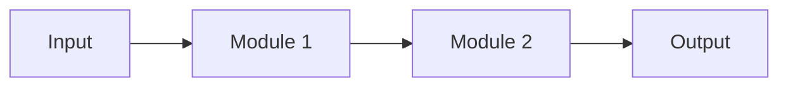

# Architecture Diagram Guide

This reference covers designing and generating academic architecture diagrams for papers.

---

## Role

Act as a world-class academic illustrator specializing in high-quality, intuitive, and aesthetic paper figures for top-tier AI/CV/NLP conferences (CVPR, NeurIPS, ICLR).

## Task

Read a method description, deeply understand its core mechanism, module composition, and data flow, then design a professional academic architecture diagram.

---

## Visual Style Requirements

### 1. Style Foundation

- Must have top-conference paper style: professional, clean, modern, minimalist.
- Core aesthetic: flat vector illustration, clean lines. Reference DeepMind or OpenAI paper figures.
- No cartoon feel, oil painting feel, or over-artistic styling. Maintain rigorous academic diagram aesthetics.
- Background must be pure white, no textures or shadows.

### 2. Color System

- Strictly use pastel/soft color tones.
- No overly saturated colors (bright red, bright green) or overly dark/heavy colors.
- Use color depth variations to distinguish different module types.
- Recommended palette: soft blues, greens, oranges, purples with light fills and thin borders.

### 3. Content & Layout

- Convert the understood methodology into clear modules and data flow arrows.
- Use modern, clean vector icons within modules to enhance intuitiveness.
- Organize flow logically: left-to-right, top-to-bottom, or circular as appropriate.
- Group related components logically.

### 4. Text Rules

- All text in the figure must be in English.
- Add clear, legible text labels for key modules and equations.
- No long sentences, descriptive paragraphs, or complex formulas in the figure. Text labels identify module identity, not explain principles.
- Font should be readable at paper print size.

### 5. Prohibitions

- No photorealistic rendering
- No messy sketch lines
- No unreadable text
- No cheap 3D shadow artifacts
- No decorative elements that don't convey information

---

## Generation Prompt (English, for image generation tools)

When using image generation tools (e.g., nano banana, DALL-E), use this English prompt template:

```
You are an expert Scientific Illustrator for top-tier AI conferences (NeurIPS/CVPR/ICML).
Your task is to generate a professional "Illustration" (main figure for the paper) based on a research paper abstract and methodology.

**Abstract:**
{abstract}

**Methodology:**
{methodology}

**Visual Style Requirements:**
1. Style: Flat vector illustration, clean lines, academic aesthetic. Similar to figures in DeepMind or OpenAI papers.
2. Layout: Organized flow (Left-to-Right, Top-to-Bottom, Circular and other shapes). Group related components logically.
3. Color Palette: Professional pastel tones. White background.
4. Text Rendering: You MUST include legible text labels for key modules or equations mentioned in the methodology.
5. Negative Constraints: NO photorealistic photos, NO messy sketches, NO unreadable text, NO 3D shading artifacts.

**Generation Instruction:**
Highlight the core novelty. Ensure the connection logic makes sense.
```

---

## Mermaid Fallback

When precise control is not needed, use Mermaid diagrams for quick pipeline sketches:



For more complex diagrams requiring precise layout, recommend DrawIO (`.drawio`) or SVG.

---

## Diagram Review Checklist

Before finalizing:
- [ ] Does the figure clearly show the data flow direction?
- [ ] Are all key modules labeled?
- [ ] Is the color scheme consistent and professional?
- [ ] Can all text be read at printed paper size?
- [ ] Does the figure highlight the core novelty?
- [ ] Is the background clean white?
