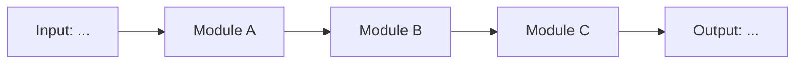
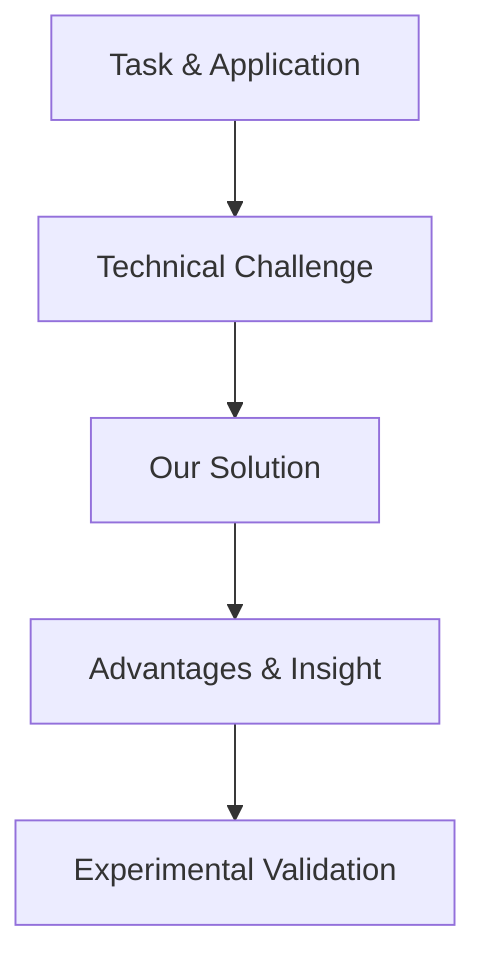

# v2 Research Landing Document Template

```markdown
# Research Landing Document: [Topic Name]

## 1. Research Overview
(Inherit from v1 concept document. Copy directly, do not re-ask.)

## 2. Technical Route

### 2.1 Overall Framework

[Mermaid pipeline diagram showing all modules and data flow]



### 2.2 Module A: [Name]
- **Motivation**: [Problem that necessitates this module]
- **Design**: [Input → processing steps → output]
- **Expected Advantage**: [Why this design over alternatives]

### 2.3 Module B: [Name]
(Same structure as 2.2)

### 2.4 Module C: [Name]
(Same structure as 2.2)

## 3. Experiment Plan

### 3.1 Datasets
| Dataset | Scale | Why Chosen | Availability |
|---------|-------|-----------|-------------|
| [Name] | N images/samples | [Standard benchmark / realistic setting] | ✅ Public |

### 3.2 Baselines
| Baseline | Paper | Year | Code | Notes |
|----------|-------|------|------|-------|
| [Name] | Author et al. | 20XX | [Link] | [Primary competitor / classical method] |

### 3.3 Evaluation Metrics
| Metric | Measures | Direction | Standard? |
|--------|----------|-----------|-----------|
| [Name] | [What it measures] | ↑ higher is better | ✅ |

### 3.4 Ablation Plan
| ID | Ablation | Tests What Claim | Expected Outcome |
|----|----------|-----------------|-----------------|
| A1 | Remove Module A | Contribution of Module A | Performance drops by ~X |
| A2 | Replace Module B with baseline variant | Design choice of Module B | Our design is better by ~Y |

### 3.5 Timeline
| Phase | Duration | Deliverable | Deadline |
|-------|----------|-------------|----------|
| Pilot experiment | 2 weeks | Feasibility validation | YYYY-MM-DD |
| Core development | 4 weeks | Full pipeline + main results | YYYY-MM-DD |
| Ablation & analysis | 2 weeks | All tables + figures ready | YYYY-MM-DD |
| Paper writing | 3 weeks | Camera-ready draft | YYYY-MM-DD |

## 4. Storyline Draft

### 4.1 Paper Logic Skeleton



### 4.2 Section Core Messages
| Section | Core Message |
|---------|-------------|
| Abstract | [One sentence summary of contribution + key result] |
| Introduction | [Challenge → insight → contribution → advantage] |
| Related Work | [Position our work within the field] |
| Method | [Pipeline overview → module details → implementation] |
| Experiments | [Main comparison → ablations → analysis] |
| Conclusion | [Reiterate contribution + impact + future work] |

## 5. Risks and Dependencies

### 5.1 Technical Risks
| Risk | Impact | Mitigation |
|------|--------|-----------|
| [Description] | [High/Med/Low] | [Fallback plan] |

### 5.2 Resource Dependencies
| Dependency | Status | Fallback |
|-----------|--------|----------|
| [GPU cluster access] | [Confirmed/Pending] | [Alternative compute] |

### 5.3 Timeline Risks
| Risk | Trigger | Mitigation |
|------|---------|-----------|
| [Pilot fails] | [Feasibility not confirmed by week 2] | [Pivot to alternative approach] |

## 6. Open Questions
- [ ] [Question 1]
- [ ] [Question 2]
```

## Usage Notes

- v2 must be complete enough that someone (human or AI) can start executing.
- All `[待补充]` markers indicate information the user still needs to provide.
- The experiment plan should connect back to the storyline: every claim in section 4.2
  should have a corresponding experiment in section 3.
- Timeline should be realistic, with buffer. If tight, flag it as a timeline risk.
